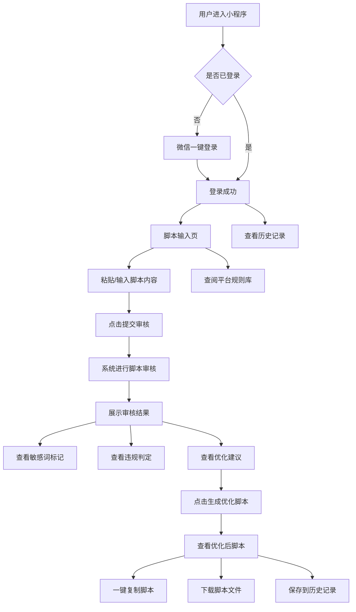

# 产品需求文档 (PRD) — 视频号脚本审核小程序

## 1. 产品概述

### 1.1 产品名称
**视频号脚本审阅助手** — 一款面向微信视频号创作者的在线脚本审核与优化工具。

### 1.2 产品定位
为视频号创作者提供一站式的视频脚本合规审核服务，帮助创作者在发布前识别敏感词、违规内容，并获得脚本优化建议，最终生成可直接使用的优化后脚本。

### 1.3 目标用户
- 微信视频号内容创作者
- MCN 机构的视频编导与运营人员
- 品牌方的视频号营销团队

### 1.4 核心价值
- **降风险**：基于视频号历年平台规则规范，前置审核脚本合规性
- **提效率**：AI 驱动的敏感词识别与优化建议，减少人工审核时间
- **便应用**：优化后脚本一键复制，无缝接入创作流程

---

## 2. 功能需求

### 2.1 用户登录模块 (微信号登录)

**功能描述**：
- 用户通过微信 OAuth 2.0 授权进行登录
- 首次登录自动创建账号，绑定微信头像与昵称
- 登录态持久化，支持自动续期

**交互流程**：
1. 用户进入小程序，展示登录引导页（Logo + 产品介绍）
2. 点击"微信一键登录"按钮
3. 调用微信授权接口获取用户信息
4. 登录成功后进入主页

**状态说明**：
- 未登录：展示登录页，限制功能使用
- 已登录：展示主页，记录用户历史审核
- Token 过期：自动刷新或提示重新登录

---

### 2.2 脚本输入模块

**功能描述**：
提供便捷的脚本内容输入窗口，支持粘贴和手动编辑。

**核心要素**：
- 富文本输入区域，支持多段落文本
- 字数统计（实时显示）
- 输入提示与占位文案："在此粘贴您的视频脚本..."
- 清空按钮、粘贴按钮
- 最大字数限制：10000 字
- 支持快捷键 Ctrl+V 粘贴

**交互细节**：
- 输入区域高度自适应，最小 200px
- 超出字数限制时输入框变红提示
- 空内容时"提交审核"按钮置灰不可点击

---

### 2.3 脚本审核模块（核心）

**功能描述**：
对用户输入的脚本内容进行多维度智能审核，涵盖敏感词检测、违规标记和优化建议。

#### 2.3.1 敏感词检测
- 基于平台规则词库，识别脚本中的敏感词汇
- 敏感词分类：
  | 类别 | 示例 |
  |------|------|
  | 政治敏感 | 涉及国家领导人、政治事件等 |
  | 色情低俗 | 违规色情、擦边内容 |
  | 暴力血腥 | 暴力场景、血腥描述 |
  | 虚假宣传 | 夸大功效、虚假承诺 |
  | 侵权内容 | 未经授权使用他人作品 |
  | 诱导分享 | 诱导转发、集赞等违规引流 |
  | 医疗健康 | 违规医疗广告、药品宣传 |
  | 金融风险 | 违规金融产品推广 |

- 检测结果以高亮标记展示在原文中
- 鼠标悬停在标记词上显示违规类别与规则来源

#### 2.3.2 违规内容判定
- 对照视频号平台规则进行逐条校验：
  - 《微信视频号运营规范》
  - 《微信视频号内容审核标准》
  - 历年更新的补充规则说明
- 判定结果分为三级：
  - **高危**（红色标记）：明确违规，建议删除或修改
  - **警告**（橙色标记）：存在风险，建议调整
  - **提示**（黄色标记）：可优化项

#### 2.3.3 优化建议生成
- 针对标记内容提供具体修改建议
- 建议类型：
  - 替换词汇建议（给出 2-3 个替代词）
  - 句式改写建议
  - 段落结构调整建议
  - 内容合规性说明
- 每条建议附带规则依据链接

---

### 2.4 审核结果展示模块

**功能描述**：
以清晰直观的方式展示审核结果。

**展示内容**：
1. **审核总览面板**：
   - 总体评分（百分制）
   - 违规统计：高危 N 处 / 警告 N 处 / 提示 N 处
   - 合规率百分比

2. **原文对比视图**：
   - 左侧：原始脚本，违规处高亮标注
   - 右侧：逐条建议卡片
   - 点击左侧高亮词，右侧自动滚动到对应建议

3. **规则依据面板**：
   - 展示违规涉及的具体平台规则条款
   - 每条规则可展开查看详细说明

---

### 2.5 优化脚本生成模块

**功能描述**：
基于审核结果，自动生成优化后的合规脚本，用户可直接复制使用。

**交互流程**：
1. 审核完成后展示"生成优化脚本"按钮
2. 点击后 AI 整合所有修改建议生成新的完整脚本
3. 优化脚本展示在独立窗口中
4. 修改内容以绿色下划线标注

**输出窗口功能**：
- 完整优化后脚本展示
- 修改痕迹对比（diff 视图）
- **一键复制**按钮（带复制成功 Toast 提示）
- 下载为 TXT 文件
- 支持二次手动编辑微调
- 保存到历史记录（登录用户）

---

### 2.6 历史记录模块

**功能描述**：
登录用户可查看过往的审核记录，方便回溯与管理。

**功能点**：
- 按时间倒序展示历史审核记录列表
- 每条记录显示：脚本标题/摘要、审核时间、合规评分
- 点击可查看完整审核详情
- 支持删除历史记录

---

### 2.7 平台规则库模块

**功能描述**：
内置视频号历年平台规则规范，供用户查阅。

**内容组织**：
- 按年份分类展示规则文档（2020 - 2026）
- 支持关键词搜索规则
- 重要规则高亮标注
- 规则更新时间线

---

## 3. 非功能需求

### 3.1 性能要求
- 页面首屏加载时间 < 2 秒
- 脚本审核响应时间 < 5 秒（1000 字以内）
- 支持最多 10000 字脚本审核

### 3.2 兼容性
- 微信内置浏览器（iOS/Android）
- 主流移动端浏览器（Chrome、Safari）
- 桌面端浏览器适配

### 3.3 安全性
- 用户脚本内容传输加密（HTTPS）
- 微信登录 Token 安全存储
- 用户数据隔离，仅本人可查看历史记录

### 3.4 可用性
- 界面简洁直观，无需学习成本
- 关键操作有明确引导
- 错误状态有友好提示

---

## 4. 用户流程图

---

## 5. 页面结构

| 页面名称 | 路由 | 说明 |
|----------|------|------|
| 登录页 | `/login` | 微信登录引导 |
| 主页（工作台） | `/` | 脚本输入 + 审核入口 |
| 审核结果页 | `/review/:id` | 审核详情展示 |
| 优化脚本页 | `/optimize/:id` | 优化后脚本展示与操作 |
| 历史记录页 | `/history` | 历史审核列表 |
| 规则库页 | `/rules` | 平台规则查阅 |
| 个人中心 | `/profile` | 用户信息与设置 |