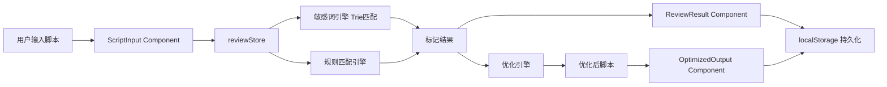

# 技术架构文档 — 视频号脚本审核小程序

## 1. 技术选型

### 1.1 前端技术栈

| 技术 | 选型 | 说明 |
|------|------|------|
| 框架 | **React 18 + TypeScript** | 类型安全，生态完善 |
| 构建工具 | **Vite 5** | 极速冷启动，HMR 热更新 |
| 路由 | **React Router v6** | SPA 单页应用路由管理 |
| 状态管理 | **Zustand** | 轻量级状态管理，API 简洁 |
| UI 组件库 | **自定义 + Radix UI** | 保持设计独特性，核心无障碍 |
| 样式方案 | **Tailwind CSS + CSS Modules** | 原子化 + 组件级隔离 |
| 动画 | **Framer Motion** | 高性能声明式动画 |
| 代码规范 | **ESLint + Prettier** | 统一代码风格 |

### 1.2 后端技术栈

由于当前为纯前端 Demo 演示版本，后端逻辑采用以下方案：

| 方案 | 说明 |
|------|------|
| **本地 Mock Service** | 使用 MSW (Mock Service Worker) 模拟 API |
| **敏感词引擎** | 前端本地词库 + 正则匹配，构建 Trie 树实现高效匹配 |
| **数据持久化** | LocalStorage / IndexedDB 存储用户历史记录 |

> **生产环境可迁移至**：Node.js (Express/Nest) + MySQL + Redis

---

## 2. 项目结构

```
script-review-app/
├── public/
│   └── favicon.svg
├── src/
│   ├── assets/
│   │   ├── images/              # 静态图片资源
│   │   └── icons/               # SVG 图标组件
│   ├── components/
│   │   ├── ui/                  # 通用 UI 组件 (Button, Input, Toast, Modal...)
│   │   ├── layout/              # 布局组件 (Header, Sidebar, TabBar)
│   │   └── features/            # 业务组件
│   │       ├── ScriptInput/     # 脚本输入组件
│   │       ├── ReviewResult/    # 审核结果展示
│   │       ├── OptimizedOutput/ # 优化脚本输出
│   │       ├── RuleLibrary/     # 规则库组件
│   │       └── HistoryList/     # 历史记录列表
│   ├── pages/
│   │   ├── LoginPage.tsx        # 登录页
│   │   ├── HomePage.tsx         # 主页/工作台
│   │   ├── ReviewPage.tsx       # 审核结果页
│   │   ├── OptimizePage.tsx     # 优化脚本页
│   │   ├── RulesPage.tsx        # 规则库页
│   │   ├── HistoryPage.tsx      # 历史记录页
│   │   └── ProfilePage.tsx      # 个人中心
│   ├── stores/
│   │   ├── authStore.ts         # 用户认证状态
│   │   ├── reviewStore.ts       # 审核流程状态
│   │   └── historyStore.ts      # 历史记录状态
│   ├── engine/
│   │   ├── sensitiveWords.ts    # 敏感词库 + Trie 匹配引擎
│   │   ├── ruleChecker.ts       # 规则匹配引擎
│   │   ├── optimizer.ts         # 脚本优化引擎
│   │   └── rules/               # 平台规则数据
│   │       ├── index.ts
│   │       ├── rules-2020.ts
│   │       ├── rules-2021.ts
│   │       ├── rules-2022.ts
│   │       ├── rules-2023.ts
│   │       ├── rules-2024.ts
│   │       ├── rules-2025.ts
│   │       └── rules-2026.ts
│   ├── hooks/
│   │   ├── useAuth.ts           # 登录状态 hook
│   │   ├── useReview.ts         # 审核逻辑 hook
│   │   └── useClipboard.ts      # 剪贴板操作 hook
│   ├── services/
│   │   ├── api.ts               # API 服务层
│   │   └── mock.ts              # MSW Mock 服务
│   ├── types/
│   │   └── index.ts             # 全局 TypeScript 类型定义
│   ├── utils/
│   │   ├── textParser.ts        # 文本解析工具
│   │   ├── formatter.ts         # 格式化工具
│   │   └── storage.ts           # 本地存储工具
│   ├── App.tsx
│   ├── main.tsx
│   └── index.css                # 全局样式 + CSS 变量
├── index.html
├── package.json
├── tsconfig.json
├── vite.config.ts
├── tailwind.config.js
└── postcss.config.js
```

---

## 3. 核心引擎架构

### 3.1 敏感词匹配引擎

采用 **Trie 树 (前缀树)** + **AC 自动机** 实现高效多模式匹配：

```
输入文本 → 分词器 → Trie 树匹配 → 分类标注 → 输出标记结果
```

- **时间复杂度**：O(n + m)，n = 文本长度，m = 匹配结果数
- **词库规模**：预计 5000+ 敏感词条
- **分类体系**：政治、色情、暴力、虚假宣传、侵权、诱导、医疗、金融 8 大类

### 3.2 规则匹配引擎

基于规则库对脚本进行逐条匹配：

```
审核结果 → 规则引擎 → 遍历匹配 → 三级判定 (高危/警告/提示) → 生成建议
```

- 每条规则包含：触发条件、违规等级、建议模板、法规依据
- 支持正则规则和关键词规则两种模式

### 3.3 脚本优化引擎

```
标记结果 + 建议列表 → 优化引擎 → 替换敏感词 → 改写句式 → 生成优化后脚本
```

- 基于规则的建议进行词汇替换
- 保留原始脚本的结构与风格
- 生成 diff 对比数据用于前端展示

---

## 4. 数据流设计



---

## 5. 路由设计

| 路由 | 页面 | 权限 |
|------|------|------|
| `/login` | 登录页 | 公开 |
| `/` | 主页（工作台） | 需登录 |
| `/review/:id` | 审核结果详情 | 需登录 |
| `/optimize/:id` | 优化脚本 | 需登录 |
| `/rules` | 规则库 | 公开 |
| `/history` | 历史记录 | 需登录 |
| `/profile` | 个人中心 | 需登录 |

路由守卫：未登录用户访问需登录页面时自动重定向至 `/login`。

---

## 6. 核心类型定义

```typescript
// 违规等级
type ViolationLevel = 'high' | 'warning' | 'info';

// 敏感词类别
type CategoryType = 
  | 'political' | 'pornographic' | 'violence' 
  | 'false_advertising' | 'infringement' | 'inducement'
  | 'medical' | 'financial';

// 敏感词标记
interface SensitiveMark {
  id: string;
  word: string;              // 敏感词
  startIndex: number;        // 原文起始位置
  endIndex: number;          // 原文结束位置
  category: CategoryType;    // 类别
  level: ViolationLevel;     // 违规等级
  suggestion: string;        // 优化建议
  alternatives: string[];    // 替代词汇
  ruleRef: string;           // 规则依据
}

// 审核结果
interface ReviewResult {
  id: string;
  originalText: string;      // 原始脚本
  score: number;             // 合规评分 0-100
  marks: SensitiveMark[];    // 标记列表
  summary: {                 // 统计摘要
    high: number;
    warning: number;
    info: number;
  };
  optimizedText: string;     // 优化后脚本
  diffData: DiffEntry[];     // diff 对比数据
  reviewedAt: number;        // 审核时间戳
}

// 用户信息
interface UserInfo {
  id: string;
  nickname: string;
  avatar: string;
}
```

---

## 7. 状态管理设计

### authStore (Zustand)
```typescript
interface AuthState {
  user: UserInfo | null;
  isLoggedIn: boolean;
  token: string | null;
  login: () => Promise<void>;
  logout: () => void;
  refreshToken: () => Promise<void>;
}
```

### reviewStore (Zustand)
```typescript
interface ReviewState {
  inputText: string;
  currentResult: ReviewResult | null;
  isReviewing: boolean;
  setInputText: (text: string) => void;
  startReview: () => Promise<void>;
  resetReview: () => void;
}
```

### historyStore (Zustand)
```typescript
interface HistoryState {
  records: ReviewResult[];
  addRecord: (record: ReviewResult) => void;
  deleteRecord: (id: string) => void;
  getRecord: (id: string) => ReviewResult | undefined;
  loadFromStorage: () => void;
}
```

---

## 8. 设计方向

### 视觉风格
- **美学方向**：现代中式极简（Modern Chinese Minimalism）——融合中国传统水墨留白美学与现代扁平设计
- **色彩体系**：
  - 主色：墨色系 `#1a1a2e` 为底，水绿 `#0d9488` 为点缀
  - 功能色：高危红 `#ef4444` / 警告橙 `#f59e0b` / 提示黄 `#eab308`
  - 背景：暖白 `#faf8f5`（模拟宣纸质感）
- **字体**：思源宋体（标题）+ 思源黑体（正文）
- **氛围**：沉稳、专业、值得信赖

### 交互设计
- 卡片式布局，适度阴影营造层次
- 审核过程中有进度动画
- 标记词 hover 有弹窗详情
- 复制成功有微动效反馈

---

## 9. 部署方案

- **开发环境**：Vite Dev Server (localhost:5173)
- **生产构建**：`vite build` 生成静态文件
- **部署平台**：腾讯云静态网站托管 / BytePlus Edge Pages CDN

---

## 10. 开发阶段规划

| 阶段 | 内容 | 产出 |
|------|------|------|
| **Phase 1** | 项目初始化，全局布局 + 登录页 | 可运行骨架 |
| **Phase 2** | 脚本输入模块 + 敏感词引擎 | 输入 + 审核 Demo |
| **Phase 3** | 审核结果展示 + 优化脚本生成 + 复制功能 | 核心流程闭环 |
| **Phase 4** | 规则库页面 + 历史记录 + 个人中心 | 完整功能 |
| **Phase 5** | 动画优化 + 移动适配 + 性能调优 | 生产就绪 |